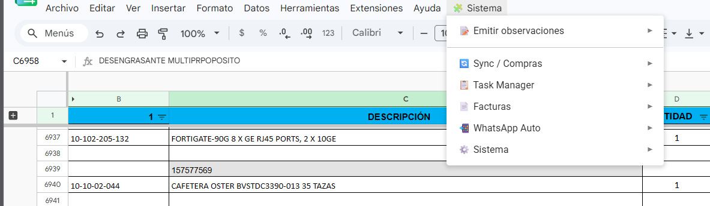
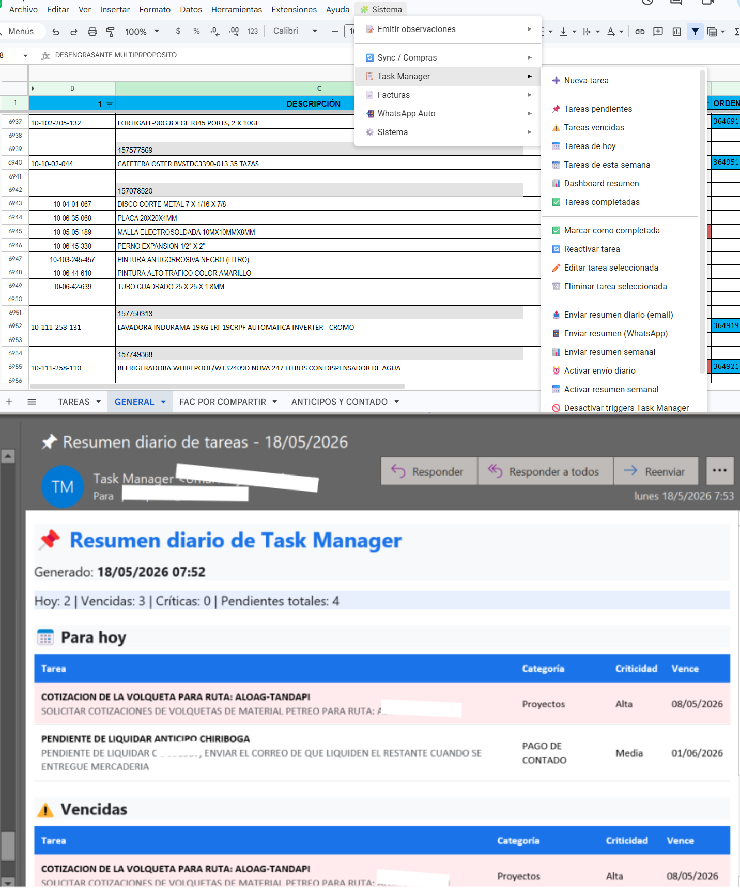
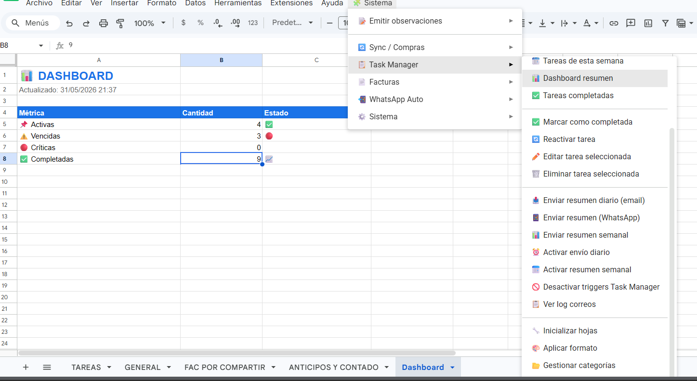
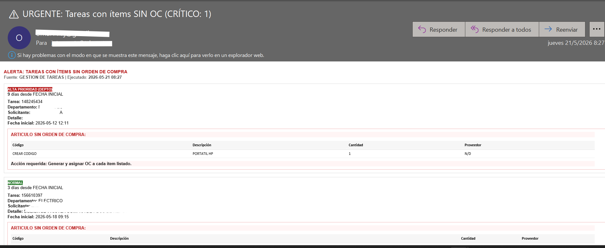
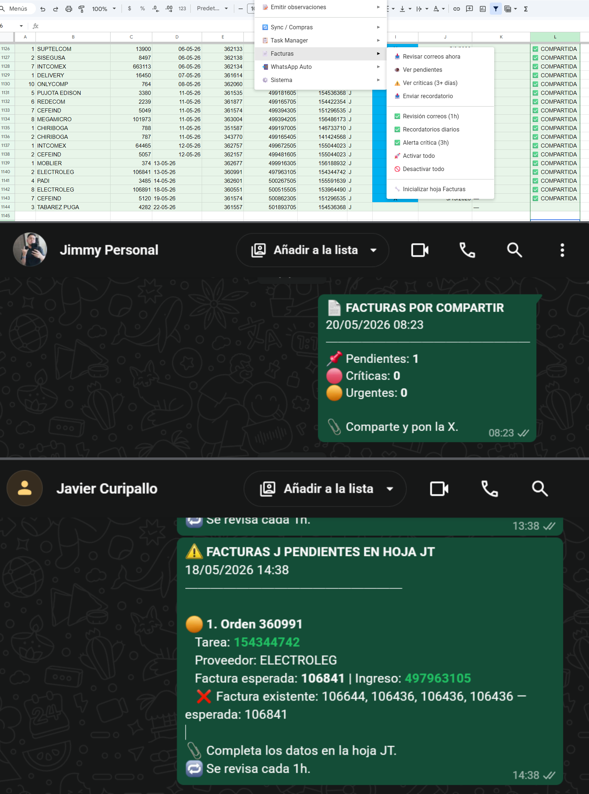
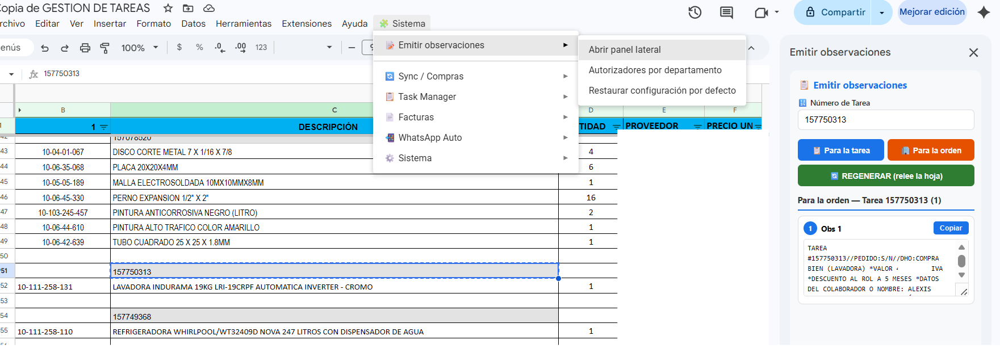
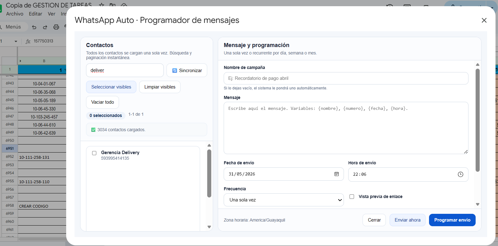
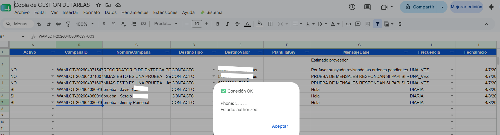

# Arquitectura del Sistema

## Gestión de Tareas Operativas — Google Apps Script Automation Suite

Este documento describe la arquitectura funcional y técnica del proyecto **Gestión de Tareas Operativas**, una suite de automatización desarrollada en **Google Apps Script** sobre **Google Sheets** para centralizar procesos administrativos, operativos y de seguimiento.

El sistema fue diseñado para trabajar sobre hojas de cálculo estructuradas, automatizar tareas repetitivas, reducir errores manuales y mejorar la trazabilidad de procesos como gestión de tareas, órdenes de compra faltantes, facturas pendientes, observaciones operativas y programación de mensajes WhatsApp mediante Green API.

---

## 1. Visión general

La solución se compone de varios módulos independientes pero integrados dentro de un mismo ecosistema de Google Apps Script.

Cada módulo cumple una responsabilidad específica:

- Configuración centralizada del sistema.
- Núcleo común y utilidades compartidas.
- Sincronización entre hojas operativas.
- Alertas automáticas por correo.
- Generación de observaciones.
- Exportación de datos.
- Gestión de tareas.
- Control de facturas pendientes.
- Automatización de mensajes WhatsApp.

La arquitectura sigue un enfoque modular para facilitar mantenimiento, escalabilidad y lectura del código.

---

## 2. Diagrama lógico de arquitectura

```text
Google Sheets
│
├── TAREAS
├── GENERAL
├── FAC POR COMPARTIR
├── Configuración
├── Completadas
├── Dashboard
├── Log Correos
├── JT_EXPORT
├── WA_AUTO_CFG
├── WA_AUTO_CONTACTOS
├── WA_AUTO_PROGRAMACION
├── WA_AUTO_PLANTILLAS
└── WA_AUTO_LOG
        │
        ▼
Google Apps Script
│
├── Configuración central
├── Núcleo del sistema
├── Sincronización operativa
├── Alertas OC
├── Observaciones
├── Exportación
├── Gestor de tareas
├── Gestor de facturas
└── WhatsApp Auto Manager
        │
        ├── GmailApp
        ├── SpreadsheetApp
        ├── MailApp
        ├── HtmlService
        ├── PropertiesService
        ├── ScriptApp
        └── UrlFetchApp
        │
        ▼
Servicios externos
│
├── Gmail
├── Correo corporativo demo
└── Green API
```

---

## 3. Capturas de referencia

Las capturas del sistema deben ubicarse en:

```text
docs/screenshots/
```

Archivos esperados:

```text
01-menu-sistema.png
02-task-manager.png
03-dashboard.png
04-alertas-oc.png
05-facturas.png
06-observaciones.png
07-whatsapp-auto.png
08-programador-whatsapp.png
```

### Menú principal del sistema



### Gestor de tareas



### Dashboard operativo



### Alertas de órdenes de compra



### Gestión de facturas



### Generador de observaciones



### WhatsApp Auto Manager



### Programador visual de WhatsApp



---

## 4. Principios de diseño

El sistema fue construido bajo los siguientes criterios:

### 4.1 Modularidad

Cada archivo `.gs` representa un módulo funcional. Esto permite separar responsabilidades, mejorar el mantenimiento y evitar que todo el proyecto se convierta en un bloque inmanejable.

### 4.2 Fuente única de configuración

Los nombres de hojas, zona horaria y constantes principales se centralizan en `00_APP_CONFIG.example.gs`.

Esto evita tener nombres repetidos en diferentes archivos y reduce errores al modificar la estructura del libro.

### 4.3 Automatización progresiva

El sistema permite ejecutar procesos manualmente desde el menú o programarlos con triggers.

Ejemplos:

- Sincronización inmediata.
- Revisión manual de correos.
- Envío automático de resúmenes.
- Programación de alertas.
- Procesamiento automático de mensajes WhatsApp.

### 4.4 Trazabilidad

El proyecto incluye hojas de log y registros operativos para auditar acciones importantes.

Ejemplos:

- Correos enviados.
- Facturas detectadas.
- Mensajes programados.
- Ejecuciones automáticas.
- Exportaciones realizadas.

### 4.5 Separación de datos sensibles

El repositorio no debe contener:

- Correos reales.
- API keys reales.
- Tokens.
- IDs reales de instancias.
- Webhooks privados.
- Datos corporativos internos.
- Información de proveedores reales.

Para documentación y ejemplos se usan valores demo como:

```text
usuario.demo@empresa.com
alertas.demo@empresa.com
PROVEEDOR DEMO S.A.
OC-DEMO-0001
FACTURA-DEMO-0001
TAREA-DEMO-0001
AUTORIZADOR DEMO 1
AUTORIZADOR DEMO 2
AUTORIZADOR DEMO 3
```

---

## 5. Módulos principales

---

## 5.1 00_APP_CONFIG.example.gs

### Responsabilidad

Centraliza la configuración base del sistema.

Define:

- Zona horaria.
- Nombres de hojas.
- Estructuras compartidas.
- Constantes reutilizables.

### Hojas definidas

```text
TAREAS
GENERAL
FAC POR COMPARTIR
Configuración
Completadas
Dashboard
Log Correos
JT_EXPORT
WA_AUTO_CFG
WA_AUTO_CONTACTOS
WA_AUTO_PROGRAMACION
WA_AUTO_PLANTILLAS
WA_AUTO_LOG
```

### Importancia arquitectónica

Este módulo funciona como la fuente única de verdad del sistema. Si una hoja cambia de nombre, se debe actualizar aquí y no en cada módulo individual.

---

## 5.2 00_CORE_REFACTORED.gs

### Responsabilidad

Contiene el núcleo del sistema y las utilidades compartidas.

### Funciones principales

```text
crearMenuSistema()
onOpen(e)
onSelectionChange(e)
trigEdit(e)
installTriggers()
GENERAL_isTaskHeaderRow_()
clearTriggersByHandler_()
isBlank_()
normalizeTaskId_()
normalizeText_()
escapeHtml_()
daysBetween_()
formatMoney_()
```

### Funcionalidad

Este archivo administra:

- Menú principal `🧩 Sistema`.
- Integración con eventos de Google Sheets.
- Funciones comunes.
- Triggers centrales.
- Normalización de textos e identificadores.
- Utilidades de fechas, dinero y HTML.

### Flujo básico

```text
Usuario abre Google Sheets
        │
        ▼
onOpen(e)
        │
        ▼
crearMenuSistema()
        │
        ▼
Menú 🧩 Sistema disponible
```

---

## 5.3 01_SYNC.gs

### Responsabilidad

Sincroniza información entre las hojas `TAREAS` y `GENERAL`.

### Funciones principales

```text
_SYNC_handleEdit(e)
_SYNC_handleSelectionChange(e)
_SYNC_onOpenLogic(e)
syncAllNow()
validateSetup()
showLastRun()
_SYNC_updateFromTareas()
_SYNC_updateFromGeneral()
_SYNC_buildGenMap()
_SYNC_buildTarMap()
```

### Funcionalidades

- Sincronización bidireccional.
- Conversión automática a mayúsculas.
- Auto-scroll.
- Posiciones guardadas.
- Validación de configuración.
- Sincronización manual desde menú.

### Flujo lógico

```text
Edición en TAREAS o GENERAL
        │
        ▼
trigEdit(e)
        │
        ▼
_SYNC_handleEdit(e)
        │
        ├── Detecta hoja origen
        ├── Normaliza valores
        ├── Actualiza hoja destino
        └── Registra cambios
```

---

## 5.4 02_OC_ALERT.gs

### Responsabilidad

Genera alertas de tareas sin orden de compra.

### Funciones principales

```text
sendTareasSinOCEmail_V2()
createDailyTrigger_V2()
debugConteo_V2()
_OC_parseTasks()
_OC_buildHtmlEmail()
_OC_buildPlainEmail()
_OC_buildSubject()
_OC_riskByDays()
_OC_writeDebug()
```

### Funcionalidades

- Detecta tareas sin OC.
- Calcula antigüedad.
- Clasifica riesgo.
- Prioriza departamentos.
- Construye correo HTML.
- Construye versión de texto plano.
- Permite depuración de conteos.

### Ejemplo de datos demo

```text
TAREA-DEMO-0001
PROVEEDOR DEMO S.A.
OC-DEMO-0001
alertas.demo@empresa.com
```

### Clasificación de riesgo

```text
Bajo        → tarea reciente
Medio       → tarea con varios días pendiente
Alto        → tarea vencida o próxima a generar impacto
Crítico     → tarea con alta antigüedad o impacto operativo
```

---

## 5.5 03_OBSERVACIONES_V3.gs

### Responsabilidad

Genera observaciones operativas por tarea y por orden.

### Funciones principales

```text
obs3_abrirSidebar()
obs3_abrirConfigSidebar()
obs3_generarParaLaTarea(taskId)
obs3_generarParaLaOrden(taskId)
obs3_restaurarConfigAutorizadores()
obs3_restaurarConfigPorDefectoConfirm()
OBS3_addToSistemaMenu_()
```

### Funcionalidades

- Abre sidebar en Google Sheets.
- Genera observaciones por tarea.
- Genera observaciones por orden.
- Administra autorizadores por departamento.
- Restaura configuración por defecto.
- Integra opciones al menú principal.

### Ejemplo de autorizadores demo

```text
AUTORIZADOR DEMO 1
AUTORIZADOR DEMO 2
AUTORIZADOR DEMO 3
```

---

## 5.6 04_GTX_EXPORT.gs

### Responsabilidad

Exporta ítems desde `GENERAL` hacia `JT_EXPORT`.

### Funciones principales

```text
GTX_exportNow()
GTX_setupTrigger_5min()
GTX_deleteTriggers()
```

### Columnas de salida

```text
TASK_ID
CODIGO
DETALLE
CANTIDAD
PROVEEDOR
OC
ROW_SRC
EXPORTED_AT
```

### Objetivo

Permite generar una vista limpia y procesable de los ítems operativos registrados en `GENERAL`.

### Flujo

```text
GENERAL
  │
  ▼
GTX_exportNow()
  │
  ▼
JT_EXPORT
```

---

## 5.7 05_TASK_MANAGER.gs

### Responsabilidad

Gestiona tareas administrativas y operativas.

### Hojas utilizadas

```text
TAREAS
Completadas
Configuración
Dashboard
Log Correos
```

### Funciones principales

```text
inicializarHojas()
mostrarFormularioNuevaTarea()
gestionarCategorias()
obtenerCategorias()
aplicarFormato()
colorearPorCriticidad()
enviarResumenDiario()
enviarResumenSemanal()
activarEnvioDiario()
activarResumenSemanal()
instalarMenuTaskManager()
```

### Funcionalidades

- Crear tareas.
- Completar tareas.
- Reactivar tareas.
- Administrar categorías.
- Definir criticidad.
- Configurar frecuencia.
- Generar dashboard.
- Enviar resumen diario.
- Enviar resumen semanal.
- Registrar correos enviados.

### Estados típicos

```text
Pendiente
En proceso
Completada
Reactivada
Vencida
```

---

## 5.8 06_FACTURAS.gs

### Responsabilidad

Gestiona facturas pendientes por compartir.

### Funciones principales

```text
facInicializarHoja()
facRevisarCorreos()
facRevisarCorreosManual()
_facExtraerFilasJ()
_facActualizarEstados()
_facAplicarFormato()
facBuildDupSet()
instalarMenuFacturas()
crearMenuFacturas()
```

### Funcionalidades

- Lee correos desde Gmail.
- Busca correos por remitente y asunto.
- Extrae datos desde tablas HTML.
- Evita duplicados.
- Actualiza estados.
- Aplica formato visual.

### Estados de factura

```text
NUEVO
PENDIENTE
URGENTE
CRÍTICO
COMPARTIDA
```

### Datos demo

```text
FACTURA-DEMO-0001
PROVEEDOR DEMO S.A.
usuario.demo@empresa.com
```

---

## 5.9 07_WHATSAPP_AUTO_MANAGER.gs

### Responsabilidad

Automatiza programación y envío de mensajes WhatsApp mediante Green API.

### Hojas utilizadas

```text
WA_AUTO_CFG
WA_AUTO_CONTACTOS
WA_AUTO_PROGRAMACION
WA_AUTO_PLANTILLAS
WA_AUTO_LOG
```

### Funciones principales

```text
WAM_inicializarModulo()
WAM_abrirVentanaProgramador()
WAM_validarConexionUI()
WAM_sincronizarContactosUI()
WAM_procesarProgramacionUI()
WAM_activarScheduler()
WAM_desactivarScheduler()
WAM_resetEstadoEjecucion()
WAM_enviarPruebaUI()
WAM_crearMenuStandalone()
```

### Funcionalidades

- Validar conexión con Green API.
- Sincronizar contactos.
- Crear plantillas.
- Programar mensajes.
- Enviar mensajes únicos.
- Enviar mensajes diarios.
- Enviar mensajes semanales.
- Enviar mensajes mensuales.
- Procesar cola.
- Administrar scheduler.
- Registrar logs.

### Datos sensibles

Las credenciales reales de Green API no deben estar en el código fuente. Deben guardarse mediante `PropertiesService`.

---

## 5.10 WAM_PROGRAMADOR_DIALOG.html

### Responsabilidad

Proporciona una interfaz visual para programar mensajes WhatsApp.

### Funcionalidades

- Buscar contactos.
- Seleccionar destinatarios.
- Configurar frecuencia.
- Escribir mensaje.
- Enviar programación al backend.
- Validar datos antes de guardar.

### Relación con backend

```text
WAM_PROGRAMADOR_DIALOG.html
        │
        ▼
google.script.run
        │
        ▼
07_WHATSAPP_AUTO_MANAGER.gs
        │
        ▼
WA_AUTO_PROGRAMACION
```

---

## 6. Eventos y triggers

El sistema utiliza eventos simples e instalables de Google Apps Script.

### Eventos principales

```text
onOpen(e)
onSelectionChange(e)
trigEdit(e)
```

### Triggers programados

```text
Sincronización
Alertas OC
Resumen diario
Resumen semanal
Revisión de facturas
Procesamiento WhatsApp
Exportación JT_EXPORT
```

### Buenas prácticas aplicadas

- Evitar duplicación de triggers.
- Limpiar triggers por handler.
- Separar ejecución manual y automática.
- Registrar errores cuando sea necesario.
- Usar funciones específicas para instalación.

---

## 7. Flujo de datos principal

```text
Usuario edita Google Sheets
        │
        ▼
Evento Apps Script
        │
        ▼
Módulo correspondiente
        │
        ├── Sincroniza datos
        ├── Actualiza estados
        ├── Envía alertas
        ├── Genera observaciones
        ├── Exporta registros
        └── Programa mensajes
        │
        ▼
Hojas de salida / Logs / Correos / API externa
```

---

## 8. Hojas del sistema

| Hoja | Propósito |
|---|---|
| `TAREAS` | Registro operativo principal de tareas. |
| `GENERAL` | Vista consolidada o matriz general de seguimiento. |
| `FAC POR COMPARTIR` | Control de facturas detectadas desde correos. |
| `Configuración` | Parámetros operativos del gestor de tareas. |
| `Completadas` | Histórico de tareas cerradas. |
| `Dashboard` | Indicadores visuales del sistema. |
| `Log Correos` | Registro de correos enviados. |
| `JT_EXPORT` | Salida estructurada de ítems exportados. |
| `WA_AUTO_CFG` | Configuración del módulo WhatsApp. |
| `WA_AUTO_CONTACTOS` | Contactos sincronizados. |
| `WA_AUTO_PROGRAMACION` | Mensajes programados. |
| `WA_AUTO_PLANTILLAS` | Plantillas de mensajes. |
| `WA_AUTO_LOG` | Registro de envíos y errores de WhatsApp. |

---

## 9. Integraciones utilizadas

### Google Sheets

Base principal del sistema.

Permite:

- Registrar datos.
- Visualizar estados.
- Ejecutar menús personalizados.
- Mantener trazabilidad operativa.

### Gmail

Utilizado para:

- Revisar correos de facturas.
- Enviar alertas.
- Enviar resúmenes diarios y semanales.

### MailApp

Utilizado para envío de correos automáticos.

### HtmlService

Utilizado para:

- Sidebars.
- Formularios.
- Ventanas modales.
- Programador visual de WhatsApp.

### PropertiesService

Utilizado para guardar configuración sensible fuera del código fuente.

### UrlFetchApp

Utilizado para conexión con Green API.

### ScriptApp

Utilizado para instalación y administración de triggers.

---

## 10. Seguridad arquitectónica

El repositorio está preparado para portafolio y documentación técnica, por lo que no debe incluir información sensible.

Elementos que deben mantenerse fuera del repositorio:

```text
API keys reales
Correos corporativos reales
IDs reales de instancias
Tokens
Contraseñas
Datos reales de proveedores
Datos reales de facturas
Datos reales de órdenes de compra
Datos reales de tareas internas
```

El archivo recomendado para documentar propiedades es:

```text
samples/script-properties.example.json
```

Ejemplo seguro:

```json
{
  "ALERT_EMAIL_TO": "alertas.demo@empresa.com",
  "GREEN_API_INSTANCE_ID": "DEMO_INSTANCE_ID",
  "GREEN_API_TOKEN": "DEMO_TOKEN",
  "DEFAULT_USER_EMAIL": "usuario.demo@empresa.com"
}
```

---

## 11. Escalabilidad

El diseño modular permite incorporar nuevas funcionalidades sin reescribir todo el sistema.

Posibles extensiones:

- Integración con Looker Studio.
- Control de permisos por usuario.
- Exportación a PDF.
- Integración con APIs internas.
- Panel web externo.
- Registro avanzado en base de datos.
- Auditoría por usuario.
- Notificaciones por Telegram o Slack.
- Validación avanzada de duplicados.
- Reportería mensual automática.

---

## 12. Decisiones técnicas destacadas

### Uso de Google Apps Script

Se eligió Google Apps Script porque permite automatizar directamente procesos sobre Google Sheets, Gmail y servicios de Google Workspace sin infraestructura adicional.

### Uso de Google Sheets como base operativa

Permite que usuarios no técnicos trabajen con el sistema sin instalar software adicional.

### Uso de menús personalizados

Centraliza la ejecución de funciones desde una interfaz accesible.

### Uso de HTML interno

Permite mejorar la experiencia del usuario con sidebars y modales.

### Uso de logs

Facilita auditoría, depuración y control operativo.

---

## 13. Limitaciones conocidas

- Google Apps Script tiene límites de tiempo de ejecución.
- El envío de correos depende de cuotas de Google.
- Green API depende de conexión externa y credenciales válidas.
- La lectura de Gmail depende de permisos autorizados.
- El rendimiento puede variar si el volumen de filas crece demasiado.
- Los triggers deben instalarse con el usuario correcto.
- La estructura de hojas debe mantenerse consistente.

---

## 14. Buenas prácticas recomendadas

- No modificar nombres de hojas sin actualizar configuración.
- Usar datos demo en repositorios públicos.
- No subir credenciales reales.
- Revisar logs antes de depurar manualmente.
- Instalar triggers desde una cuenta autorizada.
- Mantener versiones del código.
- Documentar cambios en `CHANGELOG.md`.
- Validar estructura después de copiar el proyecto.
- Separar código real de archivos `.example`.

---

## 15. Conclusión técnica

La arquitectura del proyecto permite transformar una hoja de cálculo operativa en una suite de automatización administrativa completa.

El sistema combina:

- Google Sheets como interfaz operativa.
- Google Apps Script como motor de automatización.
- Gmail como canal de entrada y salida.
- HTML interno para interfaces visuales.
- Green API para mensajería externa.
- Logs para control y auditoría.

El resultado es una solución modular, mantenible y presentable como proyecto profesional de automatización aplicada a procesos reales.
